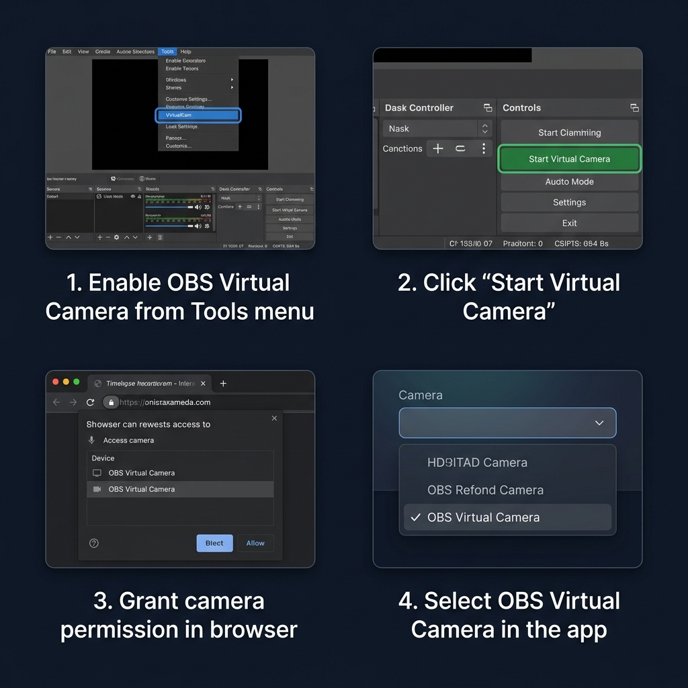
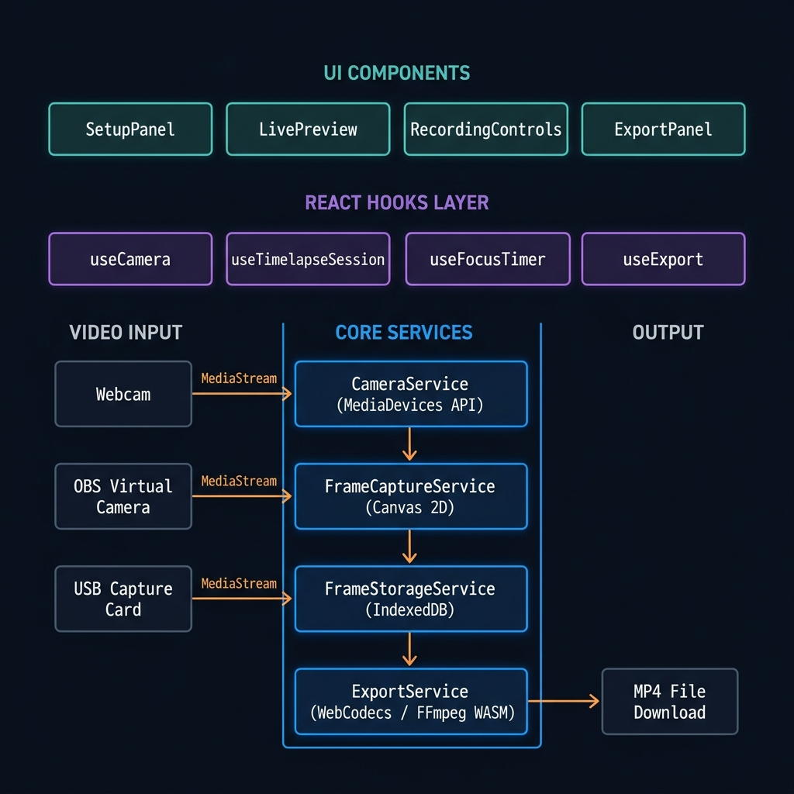
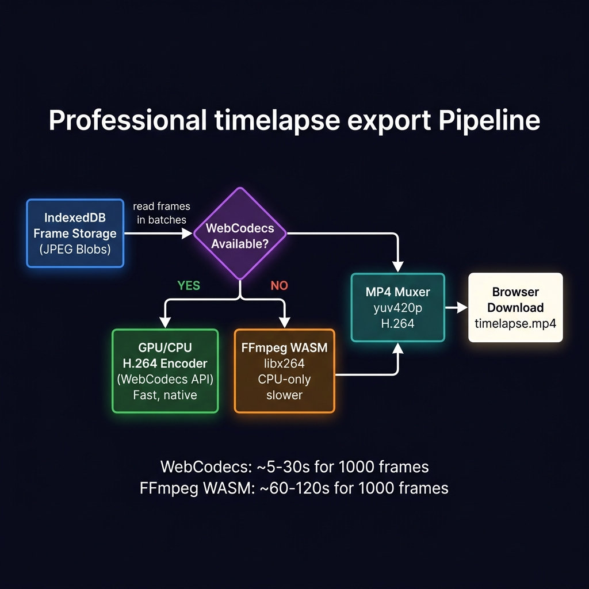

# 🎬 Timelapse Recorder

> **Browser-based timelapse studio** — capture frames from any camera source (webcam, OBS Virtual Camera, USB capture card) and export silky-smooth MP4 videos entirely in-browser. No server. No upload. 100% private.

---

## ✨ Features at a Glance

| Feature | Detail |
|---|---|
| 📷 **Camera Sources** | Webcam, OBS Virtual Camera, USB capture cards, any `videoinput` device |
| ⏱ **Capture Intervals** | 0.5s · 1s · 5s · 10s · 30s · **Custom** (any value) |
| 💾 **Local Storage** | IndexedDB — survives page refresh, supports 10,000+ frames |
| 🎞 **Export Backends** | WebCodecs (GPU-accelerated, fast) → falls back to FFmpeg WASM (CPU) |
| 🖥 **Output FPS** | 24 · 30 · 60 FPS selectable at export time |
| ⏲ **Focus Timer** | Auto-stop recording after a set duration |
| 🏷 **Burn-In Overlays** | Optional timer / live-clock overlay burned into frames |
| 📲 **PWA** | Install as a desktop/mobile app — works offline |
| 🧩 **Chrome Extension** | One-click sideload into Chrome/Brave/Edge |
| 🔒 **No Backend** | All processing is client-side — your footage never leaves your machine |

---

## 🚀 Quick Start

### Option A — Double-click launcher (Windows, easiest)

1. Make sure **Node.js 18+** is installed from [nodejs.org](https://nodejs.org)
2. Double-click **`Start Timelapse Recorder.bat`**
3. The server starts, and your browser opens automatically at `http://localhost:5173`

> The launcher handles `npm install` on first run automatically.

### Option B — Manual (any OS)

```bash
# 1. Install dependencies
npm install

# 2. Start the dev server
npm run dev

# 3. Open in browser
# → http://localhost:5173
```

> **Why localhost?** Browsers require a secure context (HTTPS or localhost) to access camera devices. The dev server also sets the COOP/COEP headers needed for multi-threaded FFmpeg WASM.

---

## 📖 How to Use

### Step 1 — Grant Camera Permission

When you first open the app, your browser will ask for camera access. Click **Allow**.

> ⚠️ Without permission, no device labels are shown (browsers hide them until you grant access). If you accidentally denied permission, click the 🔒 lock icon in the browser address bar and reset camera permissions.

### Step 2 — Select Your Video Source

Use the **Camera** dropdown in the Setup panel to pick your input:

- `Built-in Webcam` — your laptop/desktop camera
- `OBS Virtual Camera` — stream any OBS scene into the recorder *(see full guide below)*
- `USB Capture Card` — HDMI-to-USB adapters show up as regular video devices
- Any other `videoinput` device detected by the browser

Your preferred device is remembered across sessions via `localStorage`.

### Step 3 — Set Capture Interval

Choose how often a frame is captured:

| Interval | Best For |
|---|---|
| **0.5 s** | Fast-moving subjects (cooking, building LEGO) |
| **1 s** | General desktop work, coding sessions |
| **5 s** | Medium-speed activity (art, repairs) |
| **10 s** | Slow activity (plant growth, sunsets) |
| **30 s** | Very slow change (weather over a day) |
| **Custom** | Any value from 0.5s to 3600s (1 hour) |

### Step 4 — (Optional) Set a Focus Timer

Enable **Auto-Stop** to automatically end the recording after a fixed wall-clock duration. Useful for unattended capture or Pomodoro-style work sessions.

### Step 5 — Start Recording

Click **Start Recording**. A live preview shows your camera feed. Frames are saved silently to IndexedDB in the background.

> 💡 **Tip:** Keep the browser tab visible or foreground to prevent the browser from throttling the capture interval timer.

### Step 6 — Stop and Export

1. Click **Stop Recording**
2. Choose your output **FPS** (24 / 30 / 60)
3. Click **Export Timelapse**
4. Watch the progress bar — the app will automatically use GPU-accelerated WebCodecs if available, otherwise falls back to FFmpeg WASM
5. **Download** the generated `.mp4` file

---

## 📸 OBS Virtual Camera — Full Guide

OBS Virtual Camera lets you pipe **any OBS scene** (game capture, screen capture, multiple sources, filters, chroma key, etc.) into the Timelapse Recorder as if it were a regular webcam.

### Prerequisites

- **OBS Studio 27+** (Virtual Camera is built-in; older versions need a plugin)
- Windows / macOS / Linux — all supported

---

### Setup Steps




#### 1. Configure Your OBS Scene

Open OBS Studio and set up the scene you want to record as a timelapse:

```
Example scenes:
  ├── Screen Capture source      → records your full desktop
  ├── Window Capture source      → records a specific app window
  ├── Game Capture source        → records a game
  ├── Video Capture Device       → records a physical camera with OBS filters
  └── Image Slide Show           → cycles through images
```

You can apply OBS **filters** (color correction, sharpen, LUT, chroma key) — they all get baked into the virtual camera output.

#### 2. Start OBS Virtual Camera

In OBS Studio's **Controls** panel (bottom-right), click:

```
[Start Virtual Camera]
```

Or via the menu: **Tools → VirtualCam → Start**

> ✅ The button turns green and shows "Stop Virtual Camera" when active.

#### 3. Open Timelapse Recorder

Navigate to `http://localhost:5173` in your browser (or launch via the `.bat` file).

#### 4. Grant Camera Permission (First Time Only)

When prompted, click **Allow** for camera access. The browser will see OBS Virtual Camera listed alongside your real webcams.

#### 5. Select OBS Virtual Camera

In the **Camera** dropdown:

```
Camera: [ OBS Virtual Camera  ▼ ]
```

> If you don't see it:
> - Make sure Virtual Camera is **started** in OBS (step 2)
> - Click the **Refresh** button or reload the page
> - On macOS: grant the browser permission under System Settings → Privacy → Camera

#### 6. Verify the Live Preview

The preview panel should now show your OBS scene output in real time. You're ready to record!

---

### Custom Camera Mode Tips with OBS

#### 📐 Set a Custom Resolution

OBS Virtual Camera outputs at whatever resolution your OBS canvas is set to. To change it:

1. OBS → **Settings → Video**
2. Set **Base (Canvas) Resolution** to e.g. `3840×2160` (4K) or `1920×1080` (1080p)
3. Set **Output (Scaled) Resolution** — set this equal to Base for maximum quality
4. Restart Virtual Camera

The Timelapse Recorder will automatically detect and capture at the full resolution.

#### 🎨 Use OBS Filters as Camera Processing

Apply these OBS filters to your source for better timelapse output:

| OBS Filter | Purpose |
|---|---|
| **Color Correction** | Boost saturation/contrast before capturing |
| **Sharpness** | Compensate for lens softness |
| **LUT** | Apply a cinematic color grade |
| **Chroma Key** | Remove green screen background |
| **Crop/Pad** | Crop to a specific region of the screen |
| **Scaling/Aspect Ratio** | Force a specific aspect ratio |

#### 🖥 Screen Timelapse with OBS

To record a specific window or region of your screen:

1. In OBS, add a **Window Capture** or **Display Capture** source
2. Use a **Crop/Pad** filter to isolate the exact region
3. Start Virtual Camera
4. Select OBS Virtual Camera in Timelapse Recorder

This is more flexible than browser screen capture because OBS can capture outside the browser.

#### ⏱ Syncing OBS with Long Timelapses

For multi-hour sessions:
- Set your capture interval to **10s–60s** to keep frame count manageable
- OBS can run for hours without issues — just keep Virtual Camera active
- The Timelapse Recorder stores frames in IndexedDB — it handles 10,000+ frames

---

## 🏗 Architecture



```
┌──────────────────────────────────────────────────────────────┐
│                        React UI Layer                         │
│   SetupPanel  │  LivePreview  │  RecordingControls  │ Export  │
└───────────────┬──────────────────────────────────────────────┘
                │ React Context (TimelapseProvider)
┌───────────────▼──────────────────────────────────────────────┐
│                      React Hooks Layer                        │
│  useCamera  │  useTimelapseSession  │  useFocusTimer          │
│  useExport  │  useTimerOverlaySettings  │  useInstallPrompt   │
└───────────────┬──────────────────────────────────────────────┘
                │
┌───────────────▼──────────────────────────────────────────────┐
│                      Service Layer                            │
│                                                               │
│  CameraService          FrameCaptureService                   │
│  (MediaDevices API)     (Canvas 2D API)                       │
│  • enumerate devices    • capture JPEG frames                 │
│  • open media stream    • burn-in overlays                    │
│  • hot-plug detection   • configurable quality                │
│                                                               │
│  FrameStorageService    ExportService                         │
│  (IndexedDB)            (WebCodecs + FFmpeg WASM)             │
│  • save/load sessions   • GPU H.264 via WebCodecs             │
│  • iterate frames       • CPU H.264 via FFmpeg WASM           │
│  • delete sessions      • auto-detects best backend           │
└───────────────┬──────────────────────────────────────────────┘
                │
┌───────────────▼──────────────────────────────────────────────┐
│                    Browser Platform APIs                       │
│  MediaDevices  │  Canvas API  │  IndexedDB  │  WebCodecs      │
│  PWA Service Worker  │  File System Access (download)         │
└──────────────────────────────────────────────────────────────┘
```

---

## 🎞 Export Pipeline



```
IndexedDB Frames (JPEG blobs)
         │
         ▼  read in batches of 50
  ┌──────────────┐
  │ WebCodecs    │  ← available in Chrome/Edge/Safari
  │ available?   │
  └──────┬───────┘
         │
    YES  │              NO (or failed)
    ▼                       ▼
┌─────────────────┐   ┌──────────────────────┐
│ VideoEncoder    │   │ FFmpeg WASM           │
│ H.264 (avc1)   │   │ libx264, yuv420p      │
│ GPU preferred   │   │ CPU-only, slower      │
│ ~5–30s / 1k fr │   │ ~60–120s / 1k frames  │
└────────┬────────┘   └──────────┬───────────┘
         │                        │
         └──────────┬─────────────┘
                    ▼
            ┌───────────────┐
            │  mp4-muxer    │
            │  .mp4 output  │
            └───────┬───────┘
                    ▼
            Browser Download
            timelapse.mp4
```

### Export Backend Decision

The app automatically picks the fastest available encoder:

1. **WebCodecs GPU** — native H.264 via GPU, fastest (Chrome/Edge on Windows/macOS)
2. **WebCodecs CPU** — native H.264 software-encoded
3. **FFmpeg WASM** — fallback for Firefox or when WebCodecs H.264 is unavailable

---

## 🛠 Build & Deployment

### Production Build (Web)

```bash
npm run build
npm run preview    # local preview of the production build
```

### Chrome Extension Build

```bash
# Option A: double-click Build Extension.bat (Windows)

# Option B: manual
npm run build:extension
```

Then load the `extension/` folder as an unpacked extension:

1. Open `chrome://extensions` (or `brave://extensions`)
2. Toggle **Developer mode** ON
3. Click **Load unpacked**
4. Select the `extension/` folder in this project

### Cross-Origin Isolation Headers (Required for FFmpeg WASM)

Multi-threaded FFmpeg WASM requires these headers on **all** routes. The dev server sets them automatically. For production:

**Netlify** (`public/_headers`):
```
/*
  Cross-Origin-Opener-Policy: same-origin
  Cross-Origin-Embedder-Policy: require-corp
```

**nginx**:
```nginx
add_header Cross-Origin-Opener-Policy same-origin;
add_header Cross-Origin-Embedder-Policy require-corp;
```

**Cloudflare Pages** — set in the dashboard under Pages → Settings → Headers, or in `_headers`.

> Without these headers the app falls back to single-threaded FFmpeg (slower export, possible UI freeze on large sessions).

---

## 🗂 Project Structure

```
timelaspe 12/
├── src/
│   ├── components/
│   │   ├── camera/
│   │   │   └── LivePreview.tsx          # Camera feed + canvas overlay
│   │   ├── recording/
│   │   │   ├── SetupPanel.tsx           # Camera + interval selection
│   │   │   ├── RecordingControls.tsx    # Start/Stop buttons
│   │   │   ├── RecordingStatus.tsx      # Recording indicator
│   │   │   ├── FrameCounter.tsx         # Live frame count
│   │   │   ├── LiveClockDisplay.tsx     # Real-time clock overlay
│   │   │   └── RecordingTimerOverlay.tsx# Focus timer UI
│   │   ├── export/
│   │   │   ├── ExportPanel.tsx          # Export controls + download
│   │   │   ├── ExportProgressBar.tsx    # Progress feedback
│   │   │   └── FpsSelector.tsx          # Output FPS picker
│   │   ├── storage/
│   │   │   └── StorageIndicator.tsx     # IndexedDB usage display
│   │   ├── layout/                      # Page layout components
│   │   └── ui/                          # Shared form primitives
│   ├── hooks/
│   │   ├── useCamera.ts                 # Device enumeration & stream
│   │   ├── useTimelapseSession.ts       # Core recording state machine
│   │   ├── useFocusTimer.ts             # Auto-stop countdown timer
│   │   ├── useExport.ts                 # Export orchestration
│   │   ├── useTimerOverlaySettings.ts   # Burn-in overlay config
│   │   ├── usePreferredExportBackend.ts # WebCodecs/FFmpeg preference
│   │   ├── useLiveClock.ts              # Real-time clock tick
│   │   ├── useRecordingClock.ts         # Elapsed recording time
│   │   └── useInstallPrompt.ts          # PWA install prompt
│   ├── services/
│   │   ├── camera/CameraService.ts      # MediaDevices wrapper
│   │   ├── capture/FrameCaptureService.ts # setInterval + canvas
│   │   ├── storage/FrameStorageService.ts # IndexedDB operations
│   │   └── export/
│   │       ├── ExportService.ts         # Orchestrates export flow
│   │       ├── exportCapability.ts      # Encoder detection logic
│   │       ├── ffmpegLoader.ts          # Lazy-loads FFmpeg WASM
│   │       └── webCodecsExport.ts       # VideoEncoder implementation
│   ├── context/
│   │   └── TimelapseProvider.tsx        # Global app state
│   ├── types/                           # TypeScript interfaces
│   └── constants/                       # Intervals, keys, defaults
├── extension/
│   ├── manifest.json                    # Chrome Extension MV3 manifest
│   ├── background.js                    # Service worker (opens app tab)
│   ├── app/                             # Built extension output
│   └── icons/                           # Extension icons (16/48/128px)
├── public/
│   └── _headers                         # Netlify COOP/COEP headers
├── Start Timelapse Recorder.bat         # One-click Windows launcher
├── Build Extension.bat                  # One-click extension builder
├── vite.config.ts                       # Vite + PWA + COOP headers
├── tsconfig.json
└── package.json
```

---

## ⚙️ Configuration Reference

### Capture Intervals (`src/constants/intervals.ts`)

| Constant | Default | Description |
|---|---|---|
| `DEFAULT_INTERVAL_MS` | `1000` | Default capture interval (1 second) |
| `JPEG_QUALITY` | `0.82` | JPEG compression quality (0–1) |
| `STORAGE_REFRESH_EVERY_N_FRAMES` | `10` | How often storage stats update during recording |

### Session Data Model

Each recording session is stored in IndexedDB with this shape:

```typescript
interface TimelapseSession {
  id: string           // "session_<timestamp>"
  deviceLabel: string  // Camera name at time of recording
  intervalMs: number   // Capture interval used
  frameCount: number   // Frames captured so far
  status: 'recording' | 'stopped' | 'exported'
  startedAt: number    // Unix timestamp (ms)
  stoppedAt?: number   // Unix timestamp (ms)
  width: number        // Frame width in pixels
  height: number       // Frame height in pixels
  exportFps?: number   // FPS used for last export
  focusDurationMs?: number // Auto-stop duration if set
}
```

---

## 🌐 Browser Compatibility

| Browser | Recording | WebCodecs Export | FFmpeg Export | Extension |
|---|---|---|---|---|
| **Chrome 94+** | ✅ | ✅ GPU+CPU | ✅ | ✅ |
| **Edge 94+** | ✅ | ✅ GPU+CPU | ✅ | ✅ |
| **Brave** | ✅ | ✅ GPU+CPU | ✅ | ✅ |
| **Safari 16+** | ✅ | ✅ CPU only | ⚠️ limited | ❌ |
| **Firefox** | ✅ | ❌ no H.264 | ✅ | ❌ |

> **For best performance:** Use Chrome or Edge on localhost. GPU-accelerated export is dramatically faster than FFmpeg WASM.

---

## 🔧 Troubleshooting

### Camera not showing up / "No camera" in dropdown

1. Make sure you clicked **Allow** when the browser asked for camera permission
2. Check `chrome://settings/content/camera` — ensure the site is allowed
3. If OBS Virtual Camera: confirm it is **started** in OBS before opening the app
4. Try reloading the page — device enumeration runs on mount

### OBS Virtual Camera not detected

- OBS Virtual Camera installs a system driver. Some antiviruses block it.
- On Windows: try running OBS as **Administrator** once
- On macOS Ventura+: grant OBS permission under **System Settings → Privacy & Security → Camera**
- Verify the driver is installed: `Device Manager → Cameras → OBS Virtual Camera`

### Export is very slow

- If you see "Using FFmpeg fallback" — your browser doesn't support WebCodecs H.264
- Switch to **Chrome** or **Edge** for GPU-accelerated export
- Enable hardware acceleration: `chrome://settings/system` → "Use graphics acceleration when available"

### Export failed / black video

- Ensure the session has at least **2 frames** captured
- Verify the canvas dimensions are even numbers (the app handles this automatically)
- Check the browser console for errors (`F12 → Console`)

### Page freezes during export (Firefox / Safari)

- Single-threaded FFmpeg WASM can freeze the tab on large sessions
- Use Chrome/Edge for multi-threaded support (requires the COOP/COEP headers set by the dev server)

### "Keep tab focused" warning

Browser timer APIs are throttled when a tab is backgrounded or the system sleeps. For consistent intervals:
- Keep the Timelapse Recorder tab in the **foreground**
- Disable battery saver / aggressive tab suspension in your browser settings

---

## 🔌 PWA Installation

Install Timelapse Recorder as a native-feeling desktop app:

1. Click the **Install** button in the app header, OR
2. Click the install icon (⊕) in the browser's address bar
3. Confirm installation

Once installed, it launches in its own window without browser chrome, and works offline (except for initial FFmpeg WASM download on first export).

---

## 🗺 Roadmap / Extension Points

The codebase is designed for extension. Key interfaces:

| Interface | Location | Purpose |
|---|---|---|
| `CaptureSource` | `types/` | Add screen capture, IP cameras |
| `StorageBackend` | `types/storage.ts` | Add cloud sync (S3, Drive) |
| `ExportFormat` | `types/export.ts` | Add GIF, WebM, 4K, ProRes |

Planned features:

- [ ] Screen capture mode (browser tab / window)
- [ ] Motion-triggered capture
- [ ] Scheduled / cron-style recording
- [ ] Multi-camera PiP layouts
- [ ] GIF export
- [ ] Cloud sync

---

## 📄 License

MIT — do whatever you want with it.

---

## 🙏 Credits

- [FFmpeg WASM](https://github.com/ffmpegwasm/ffmpeg.wasm) — in-browser video transcoding
- [mp4-muxer](https://github.com/Vanilagy/mp4-muxer) — JavaScript MP4 container writer
- [Lucide React](https://lucide.dev) — icon set
- [Vite](https://vitejs.dev) + [React 19](https://react.dev) — build toolchain
